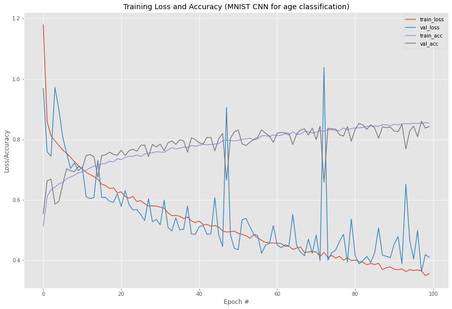
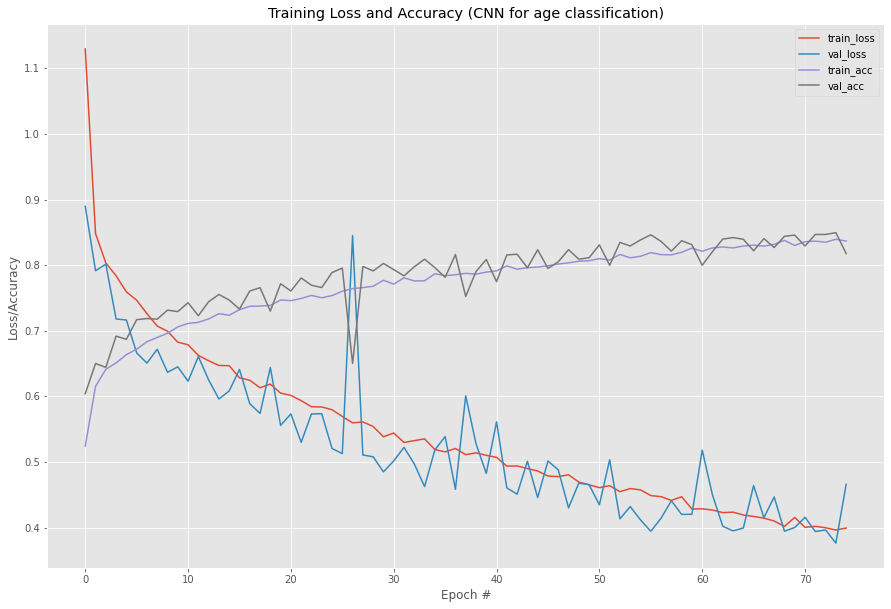
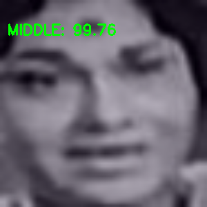
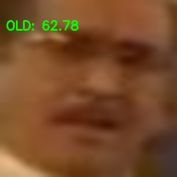

# Age Classification using CNN

## Overview
A Convolutional Neural Network designed from scratch trained using Keras framework that categorizes images of people based on their ages. 
The model categorizes the input image based on three categories- Young , Middle and Old. 

## Preprocessing
The following preprocessing was applied to each image:

- Have trained the network on frontal faces images
- Random crops of 64 × 64 pixels from the input image of random sizes
- Randomly mirror images in each forward-backward training pass
- Data Augmentation is used

## Model Description
For **Age Classification**, following are the details of the model: 

1. 3x3 filter shape, 32 feature maps. Stride of 1 and 0 padding. Followed by: ReLU,Batch-Normalization,Max-Pool,Dropout of 0.25
2. 3x3 filter shape, 64 feature maps. Followed by: Batch-Normalization
3. 3x3 filter shape, 64 feature maps,stride 1 and padding 1. ReLU, Batch-Normalization,Max-Pool of size 2,Dropout of 0.25.
4. 3x3 filter shape, 128 feature maps. Followed by: Batch-Normalization
5. 3x3 filter shape, 128 feature maps. Followed by: Batch-Normalization
6. 3x3 filter shape, 128 feature maps,stride 1 and padding 1. ReLU, Batch-Normalization,Max-Pool of size 2,Dropout of 0.25.
7. Fully connected layer of 512 neurons. Followed by : ReLU,Batch Normalization, Dropout = 0.5. 
8. Last layer maps to the 3 classes for age
  
Trained with a learning rate of 0.01,Batch Size of 32 and with 75 to 100 epochs.
Used Stochastic gradient descent optimizer and 70% split of train and validation data
Used OpenCV for data visualization and augmentation

## Libraries Used
-OpenCV
-Keras
-Numpy
-Pandas
-Seaborn
-Matplotlib
-Pickle
-sklearn

## Results

Training Accuracy : **85.48%**
Validation Accuracy : **84.29%**

---

